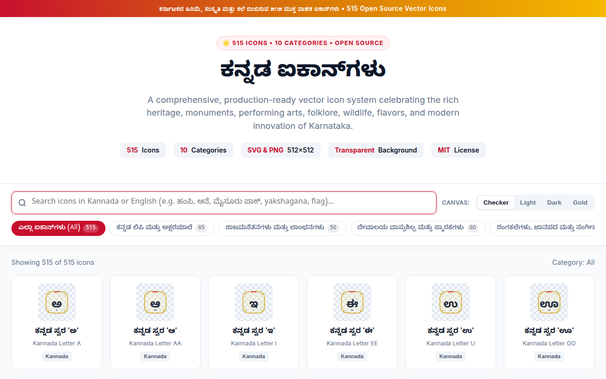
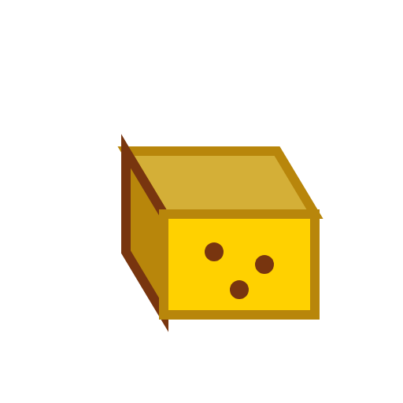

# ಕನ್ನಡ ಐಕಾನ್‌ಗಳು — Kannada Icons Collection

<p align="center">
  
</p>

<p align="center">
  <strong>೧೦೨೩+ ಮುಕ್ತ ವಾಹಕ ಐಕಾನ್‌ಗಳು • 1,020+ Production-Ready Vector & 3D App Icons</strong><br>
  <em>Celebrating Karnataka’s 2000+ year cultural heritage, temple architecture, performing arts, folklore, wildlife, culinary treasures, and modern Bengaluru innovation.</em>
</p>

<p align="center">
  
  
  
  
  
</p>

---

## 🌟 Dual Editions

This repository provides two distinct, comprehensive icon collections:

### 1. 🎨 Nano Banana 3D App Icons Edition (508 Icons)
- **508 Standalone High-Resolution 512×512 PNG Icons** located in [`nano-banana-icons/individual/`](nano-banana-icons/individual/).
- **56 Master Thematic Pack Sheets** (each containing 9 iconic vectors) in [`nano-banana-icons/`](nano-banana-icons/).
- Generated using state-of-the-art **Nano Banana** multimodal AI image generation with vivid 3D gloss, authentic Kannada cultural details, and app icon aesthetic.
- Interactive catalog: [`nano_banana.html`](nano_banana.html).

### 2. 📐 Standard Flat & Duo-tone Vector Icons Edition (515 Icons)
- **515 Handcrafted Vectors**: Standardized on a `64x64` coordinate grid with uniform stroke weights (`1.5px` - `2.5px`).
- Available in scalable vector [`svg/`](svg/) and transparent raster [`png/`](png/) (`512x512`).
- Interactive catalog: [`index.html`](index.html).

- **100% Transparent Backgrounds**: Seamlessly drop into light, dark, colored, or textured design canvases.
- **Dual Formats**:
  - `svg/`: Crisp, scalable vector source files (`.svg`).
  - `png/`: High-resolution `512x512` anti-aliased transparent raster exports (`.png`).
- **Bilingual & Searchable**: Every icon is labeled with both Kannada (`ಕನ್ನಡ ಹೆಸರು`) and English names, categorized, and tagged in `icons.json`.
- **Interactive Web Catalog**: Zero-dependency `index.html` with instant live search in Kannada & English, category filters, background switchers, and single-click SVG/PNG copying and downloading.
- **Graphic Design Ready**: Ideal for Figma, Sketch, Adobe Illustrator, Canva, web applications, Flutter/React Native apps, print media, and festival posters.

---

## 📂 Category Breakdown (515 Icons)

| # | Category | ಕನ್ನಡ ಹೆಸರು | Icons | Description |
|---|----------|-------------|:-----:|-------------|
| 1 | **[Script & Typography](svg/script-typography/)** | ಕನ್ನಡ ಲಿಪಿ ಮತ್ತು ಅಕ್ಷರಮಾಲೆ | **65** | Swaragalu (15), Vyanjanagalu (34), Kannada Numerals ೦-೯ (10), Typographical & Sacred Glyphs (6) |
| 2 | **[Emblems & Royalty](svg/emblems-royalty/)** | ರಾಜಮನೆತನಗಳು ಮತ್ತು ಲಾಂಛನಗಳು | **50** | Gandaberunda, Hoysala Sala, Kadamba Lion, Chalukya Varaha, Wodeyar Crest, Mysore Peta, Golden Ambari |
| 3 | **[Architecture & Monuments](svg/architecture-monuments/)** | ದೇವಾಲಯ ವಾಸ್ತುಶಿಲ್ಪ ಮತ್ತು ಸ್ಮಾರಕಗಳು | **60** | Hampi Stone Chariot, Virupaksha Gopuram, Mysore Palace, Belur Stellate Star, Gol Gumbaz, Bahubali Monolith |
| 4 | **[Performing Arts & Music](svg/performing-arts-music/)** | ರಂಗಕಲೆಗಳು, ಜಾನಪದ ಮತ್ತು ಸಂಗೀತ | **50** | Yakshagana crowns (Tenkutittu & Badagutittu), Dollu Kunitha, Veeragase, Kamsale, Bhoota Kola, Mysore Veena |
| 5 | **[Crafts, Textiles & Jewelry](svg/crafts-textiles-jewelry/)** | ಕರಕುಶಲ ವಸ್ತುಗಳು ಮತ್ತು ಆಭರಣಗಳು | **50** | Mysore Silk sarees, Ilkal Tope Teni, Channapatna toys, Bidriware, Sandalwood carving, Kasuti embroidery, Temple jewelry |
| 6 | **[Wildlife, Flora & Fauna](svg/wildlife-flora-fauna/)** | ವನ್ಯಜೀವಿಗಳು ಮತ್ತು ಸಸ್ಯಸಂಪತ್ತು | **50** | Asian Elephant, Indian Roller (Neelakantha), Lotus, Sandalwood tree, Bengal Tiger, Blackbuck, Lion-tailed Macaque |
| 7 | **[Geography, Rivers & Hills](svg/geography-nature/)** | ಭೌಗೋಳಿಕ ಪರಿಸರ, ನದಿಗಳು, ಗಿರಿಶಿಖರಗಳು | **45** | Karnataka state map, Sahyadri Western Ghats, Jog Falls, Shivanasamudra, Mullayanagiri, Cauvery, Yana Karsts, Kaup Lighthouse |
| 8 | **[Cuisine & Flavors](svg/cuisine-flavors/)** | ಕರ್ನಾಟಕದ ಖಾದ್ಯ ವೈವಿಧ್ಯ ಮತ್ತು ಸಿಹಿತಿಂಡಿಗಳು | **50** | Mysore Pak, Dharwad Peda, Davangere Benne Dosa, Masala Dosa, Thatte Idli, Bisi Bele Bath, Ragi Mudde, Filter Coffee |
| 9 | **[Festivals & Literature](svg/festivals-traditions-literature/)** | ಹಬ್ಬಗಳು, ಸಾಹಿತ್ಯ ಮತ್ತು ಸಂಸ್ಕೃತಿ | **50** | Karnataka Bicolor Flag, Jamboo Savari, Kambala racing, Ugadi Bevu-Bella, Karaga, Kuvempu, Basavanna, 8 Jnanpith Awards |
| 10 | **[Modern Karnataka & Lifestyle](svg/modern-karnataka-lifestyle/)** | ಆಧುನಿಕ ಕರ್ನಾಟಕ ಮತ್ತು ತಂತ್ರಜ್ಞಾನ | **45** | Namma Metro, BMTC bus, Auto Rickshaw, Silicon Valley chip, ISRO rocket & satellite, HAL Tejas, Mysore Sandal Soap, IISc |
| **Total** | | | **515** | |

---

## 🚀 Quick Start

### 1. Browse the Interactive Web Catalog
Open `index.html` in any web browser (no local web server needed):
```bash
# On Linux
xdg-open index.html

# On macOS
open index.html

# On Windows
start index.html
```

### 2. Using with Figma or Adobe Illustrator
- Simply drag and drop any `.svg` file from the `svg/` directory directly onto your canvas or artboard.
- The SVGs are pure vectors, allowing you to freely scale, recolor, and extract individual path layers.

### 3. Using in HTML / Web Applications
```html
<!-- Inline SVG -->
<svg width="48" height="48" viewBox="0 0 64 64">
  <!-- Paste SVG content from svg/<category>/<icon_id>.svg -->
</svg>

<!-- As an Image Tag -->


```

### 4. Using in React / Next.js
```jsx
import React from 'react';

export const GandaberundaIcon = ({ size = 48, className = "" }) => (
  
);
```

### 5. Accessing Programmatic Metadata
All 515 icons and categories are fully indexed in `icons.json`:
```json
{
  "id": "arch_01_hampi_stone_chariot",
  "name": "Hampi Stone Chariot (Vittala Temple)",
  "kannada_name": "ಹಂಪಿ ಕಲ್ಲಿನ ರಥ (ವಿಜಯ ವಿಠ್ಠಲ)",
  "category_slug": "architecture-monuments",
  "tags": ["architecture", "monument", "hampi", "vijayanagara", "stonechariot"],
  "svg_relative_path": "svg/architecture-monuments/arch_01_hampi_stone_chariot.svg",
  "png_relative_path": "png/architecture-monuments/arch_01_hampi_stone_chariot.png"
}
```

---

## 🎨 Design System & Palette

The icon system is anchored in Karnataka's iconic royal and natural color palette:

| Color Token | Hex Code | Representation |
|-------------|:--------:|----------------|
| **Kannada Red** | `#C8102E` | State Flag crimson band, Kunkuma, Royal passion |
| **Kannada Yellow** | `#F5B800` | State Flag turmeric yellow band, Arasina, Joy |
| **Karnataka Gold** | `#D97706` | Temple brass, Mysore Ambari, Royal Hoysala gold |
| **Deep Forest Green** | `#15803D` | Western Ghats flora, Coorg coffee plantations |
| **Cauvery Royal Blue** | `#1D4ED8` | Sacred Cauvery & Krishna river waters |
| **Arabian Sky Blue** | `#0284C7` | Karavali coastline, Arabian Sea sky |
| **Heritage Slate** | `#475569` | Hampi granite, Belur soapstone, Badami caves |
| **Obsidian Dark** | `#0F172A` | Crisp architectural contours, Bidriware black patina |
| **Temple Cream** | `#FFFBEB` | Sandalwood paste, Mysore silk fabric |

---

## 📁 Repository Structure

```
kannada-icons/
├── svg/                                    # 515 Vector SVG files
│   ├── script-typography/                  # 65 icons
│   ├── emblems-royalty/                    # 50 icons
│   ├── architecture-monuments/             # 60 icons
│   ├── performing-arts-music/              # 50 icons
│   ├── crafts-textiles-jewelry/            # 50 icons
│   ├── wildlife-flora-fauna/               # 50 icons
│   ├── geography-nature/                   # 45 icons
│   ├── cuisine-flavors/                    # 50 icons
│   ├── festivals-traditions-literature/    # 50 icons
│   └── modern-karnataka-lifestyle/         # 45 icons
├── png/                                    # 515 Transparent 512x512 PNG files
│   └── [identical category folders]
├── scripts/                                # Generation & export toolchain
│   ├── icon_data/                          # 10 Python category generator modules
│   ├── generate_all.py                     # Master SVG & JSON generator
│   ├── export_pngs.py                      # Headless Chrome 512px PNG exporter
│   └── build_catalog.py                    # Standalone index.html builder
├── icons.json                              # Master metadata index
├── index.html                              # Standalone interactive web catalog
├── catalog_preview.png                     # Visual showcase screenshot
├── package.json                            # NPM package descriptor
├── LICENSE                                 # MIT License
└── README.md                               # Project documentation
```

---

## 🛠️ Regeneration & Build Toolchain

To regenerate SVGs, re-export PNGs, or rebuild the catalog from the python source definitions:

```bash
# 1. Regenerate all 515 SVGs and icons.json
python3 scripts/generate_all.py

# 2. Re-export all 515 high-res 512x512 transparent PNGs
python3 scripts/export_pngs.py

# 3. Rebuild the standalone index.html web catalog
python3 scripts/build_catalog.py
```

---

## 📄 License

This collection is proudly open-sourced under the [MIT License](LICENSE). You are free to use, modify, distribute, and integrate these icons in both personal and commercial projects without royalties.

Crafted with ❤️ for Karnataka and Kannada enthusiasts across the globe.
