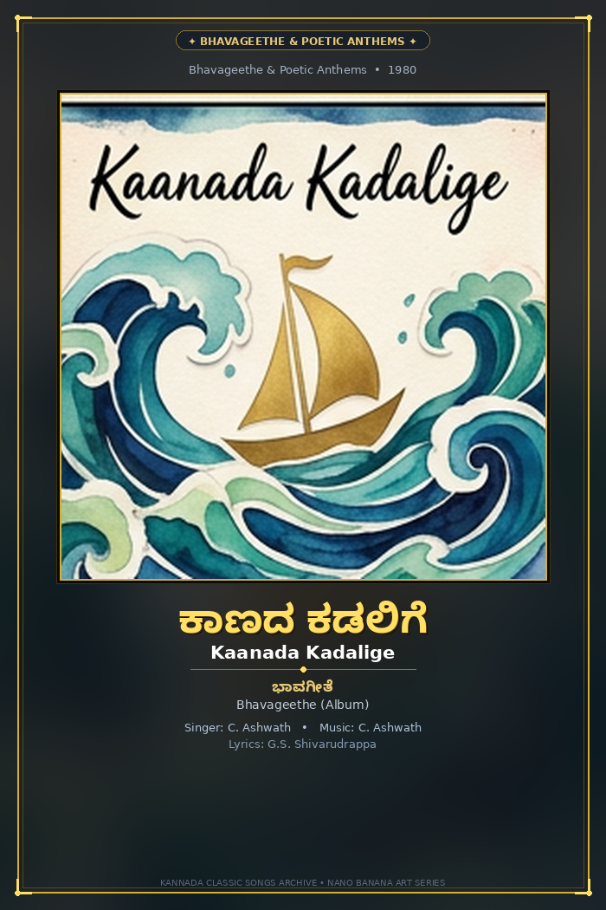
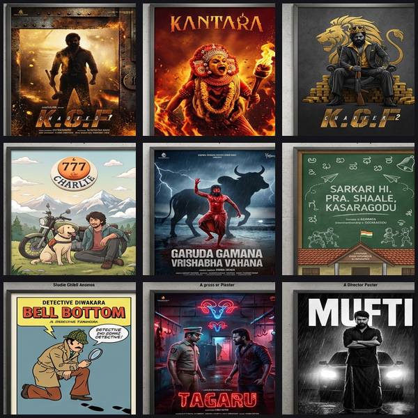

# ಕನ್ನಡ ಐಕಾನ್‌ಗಳು, ಕ್ಲಾಸಿಕ್ ಚಲನಚಿತ್ರ ಮತ್ತು ಗೀತೆಗಳ ಪೋಸ್ಟರ್‌ಗಳು
## Kannada Icons, Classic Cinema & Landmark Song Posters Archive

  
  
  

  <strong>೧೫೩ ಕ್ಲಾಸಿಕ್ ಹಾಡುಗಳ ಪೋಸ್ಟರ್‌ಗಳು + ೧೦೮ ಚಲನಚಿತ್ರ ಪೋಸ್ಟರ್‌ಗಳು + ೧೦೨೩+ ಮುಕ್ತ ವಾಹಕ ಐಕಾನ್‌ಗಳು</strong> 
  <strong>153 Landmark Kannada Song Posters • 108 Reimagined Movie Posters • 1,023+ Vector & 3D App Icons</strong> 
  <em>Celebrating Karnataka’s 2000+ year cultural heritage, temple architecture, performing arts, folklore, culinary treasures, and 70+ years of landmark Kannada cinema & music traditions.</em>

  
  
  
  
  
  

---

## 🌟 Four Flagship Collections

This repository is an all-in-one graphic design archive containing four premier digital art collections:

### 1. 🎵 153 Landmark Kannada Song Posters (Native Kannada Typography)
- **153 Individual High-Resolution Posters (700×1050 PNG)** in [`songs/individual/`](songs/individual/).
- **17 Master Exhibition Sheets (3×3 Art Grids)** in [`songs/sheets/`](songs/sheets/).
- **No Realism**: Rendered across diverse stylized art movements (Japanese Ukiyo-e, Soviet Constructivism, Ghibli Watercolor, Bauhaus Geometric, Psychedelic Folk, Gothic Woodcut, Synthwave Neon Noir, 8-Bit Pixel, Linocut, Stained Glass).
- **Native Kannada Fonts**: Every poster prominently features authentic **Kannada script typography** (`NotoSansKannada-Bold.ttf`) alongside English titles, release years, singer, composer, lyricist, and art movement notes.
- **17 Curated Themes**: Bhavageethe & Poetic Anthems, Kannada Pride & Rajyotsava, Golden Era Romance, Dr. Rajkumar Philosophical, Ilaiyaraaja Melodies, Hamsalekha Magic, Monsoon & Rain, Spiritual & Bhakti, Folk Janapada, Upendra Cult Hits, 2000s Youth Anthems, Pan-Indian Epics, Contemporary Ballads, Classical Ragas, Retro Grooves, Sugama Sangeetha, and Indie Waves.
- **Interactive Web Gallery**: [`songs.html`](songs.html) with bilingual instant search (Kannada & English), theme filter chips, individual vs exhibition sheet switcher, and download modal.

### 2. 🎬 108 Classic Kannada Movie Posters Reimagined
- **108 Individual High-Resolution Posters (700×1050 PNG)** in [`posters/individual/`](posters/individual/).
- **12 Master Exhibition Sheets (3×3 Art Grids)** in [`posters/sheets/`](posters/sheets/).
- **Prominent Kannada Typography**: Every poster features the title rendered in native Kannada script alongside director, cast, and year.
- **10+ Global Art Movements**: Constructivist Agitprop, Stained Glass, Art Deco, Cyberpunk Neon, Japanese Woodblock, and more.
- **Interactive Web Gallery**: [`posters.html`](posters.html).

### 3. 🍌 508 Nano Banana 3D App Icons Edition
- **508 Standalone 512×512 PNG Icons** located in [`nano-banana-icons/individual/`](nano-banana-icons/individual/).
- **56 Master Thematic Pack Sheets** in [`nano-banana-icons/`](nano-banana-icons/).
- Generated using state-of-the-art **Nano Banana** multimodal AI image generation with vivid 3D gloss, authentic Kannada cultural details, and app icon aesthetic.
- **Interactive Web Catalog**: [`nano_banana.html`](nano_banana.html).

### 4. 🎨 515 Standard Flat & Duo-tone Vector Icons Edition
- **515 Handcrafted Vectors**: Standardized on a `64x64` coordinate grid with uniform stroke weights.
- Formats: Scalable vector [`svg/`](svg/) and transparent raster [`png/`](png/) (`512x512`).
- Spans 10 cultural categories: Script, Royalty, Architecture, Arts, Crafts, Wildlife, Geography, Cuisine, Literature, Modern Karnataka.
- **Interactive Web Catalog**: [`index.html`](index.html).

---

## 🎵 153 Classic Kannada Song Posters Breakdown (17 Master Sheets)

| Sheet | Theme / Genre | Art Movement Style | Sample Landmark Songs Included |
|:-----:|---------------|-------------------|--------------------------------|
| **01** | **Bhavageethe & Poetic Anthems** | Abstract Watercolor & Paper Cutout | *Kaanada Kadalige, Kurigalu Saar, Taravva Thangi, Jogada Siri Belakinalli, Benne Kadda* |
| **02** | **Kannada Pride & Rajyotsava** | Soviet Constructivist & Silkscreen | *Huttidare Kannada Nadalli, Baarisu Kannada Dindimava, Jenina Holeyo, Kannada Nadina Jeevanadi* |
| **03** | **Golden Era Romance & Serenades** | Mid-Century French Lithograph | *Aaha Nanna Sangaathi, Baala Nonada Raagave, Gaanave Jeeva, Kangalu Tumbiralu* |
| **04** | **Dr. Rajkumar Philosophical** | Surrealist Marionette & Woodcut | *Aadisi Nodu Beelisi Nodu, Yaare Koogadali, Beladingalaagi Baa, Naa Ninna Mareyalare* |
| **05** | **Ilaiyaraaja 1980s Melodies** | Synthwave Sunset & Vinyl Minimal | *Naguva Nayana, Jotheyali Jothe Jotheyali, Hrudaya Rangoli, Santasa Araluva Samaya* |
| **06** | **Hamsalekha 1990s Magic** | Psychedelic Pop & Stained Glass | *Premalokada Paarijaathave, O Priyathama, Bombe Heluthaithe, Chaitrada Premanjaliya* |
| **07** | **Monsoon & Rain Romance** | Impressionist Oil & Rain Vignette | *Anisuthide Yaako Indu, Mungaru Maleye, Beladingalaagi Baa, Male Ninthu Hoda Mele* |
| **08** | **Spiritual Bhakti & Haridasa** | Sacred Tanjore Gold Foil & Brass | *Bhagyada Lakshmi Baramma, Kaayo Shri Gananatha, Jagadoddharana, Krishna Nee Begane Baaro* |
| **09** | **Folk & Janapada Traditions** | Madhubani Earth & Terracotta | *Mayadantha Male Bantanna, Kuri Kayo Kuruba, Moodal Kunigal Kere, Kolu Mande Jangamadeva* |
| **10** | **Upendra Cult & Experimental** | Surrealist Dali & Cyberpunk Noir | *En Kathe Helali, Maari Kannu Hori Myage, Uppittu Saaku Nange, Kanyakumari* |
| **11** | **2000s Youth & Romance** | Pop Manga & Sunlit Pastel | *Neenene Nanna Saviganasu, Milana Milana, Usire Usire, Anthu Inthu Preethi Bantu* |
| **12** | **Modern Pan-Indian Epics** | Heavy Metal Gold Dust & Bioluminescent | *Singara Siriye, Varaha Roopam, Salaam Rocky Bhai, Dheera Dheera, Toofan, Mehabooba* |
| **13** | **Contemporary Ballads & Fusion** | Ocean Wave Cutouts & 8-Bit Pixel | *Sapta Saagaradaache Ello, Lokada Kaalaji, Gudugudiya Sedi Nodu, Marali Manasaagide* |
| **14** | **Classical Carnatic Ragas** | Celestial Soundwaves & Swara Mandala | *Naadamaya Ee Lokavella, Shankarabharanam, Maamavathu Shri Saraswathi, Paavamana* |
| **15** | **Retro Grooves & Playful Pop** | Rangoli Patterns & 70s Disco Vectors | *Ellamma Rangoli Cheluve, Shankar Guru Disco, Baare Santhege Hogona, Priya Priya* |
| **16** | **Sugama Sangeetha & Nature** | Botanical Lithograph & Calligraphy | *Baaro Sadhanakerige, Kuniyonu Baara, Ilidu Baa Thaayi, Moodala Maneya, Thaaye Baa* |
| **17** | **Indie Waves & New Age Cinema** | Rural Charcoal & Minimalist Vector | *Thithi Village Ballad, Rama Rama Re, Maleye Maleye, Daariya Konege, Motte Heggade* |

---

## 🎬 108 Reimagined Movie Posters Breakdown (12 Master Sheets)

| Sheet | Theme / Era | Decade / Era | Landmark Films Included |
|:-----:|-------------|:------------:|-------------------------|
| **01** | **Golden Era Epics** | 1950s–1970s | *Bedara Kannappa, Bhakta Prahlada, Satya Harishchandra, Bangarada Manushya, Naagarahaavu, Babruvahana, Mayura, Kasturi Nivasa, Eradu Kanasu* |
| **02** | **Art-House & Parallel Cinema** | 1970s–2000s | *Chomana Dudi, Samskara, Ghatashraddha, Tabarana Kathe, Kaviratna Kalidasa, Bhakta Kumbara, Bhookailasa, Bhoomi Geetha, Chigurida Kanasu* |
| **03** | **1980s Action Thrillers & Sci-Fi** | 1975–1993 | *Antha, Accident, Geetha, Shankar Guru, CBI Shankar, Ranadheera, Premada Kanike, Daari Tappida Maga, Nishkarsha* |
| **04** | **Romance & Musicals** | 1982–1997 | *Bandhana, Muthina Haara, Hrudaya Haadithu, Pushpaka Vimana, Beladingala Baale, Amruthavarshini, Janumada Jodi, America America, Haalu Jenu* |
| **05** | **Cult Underworld & Upendra** | 1990–2002 | *Om, A, Upendra, AK-47, Tarle Nan Maga, Gauri Ganesha, Ganeshana Maduve, Yaare Neenu Cheluve, Appu* |
| **06** | **2000s New Wave Blockbusters** | 2005–2010 | *Mungaru Male, Duniya, Aa Dinagalu, Jogi, Gaalipata, Milana, Jackie, Kallarali Hoovagi, Eddelu Manjunatha* |
| **07** | **Kannada Indie Revolution** | 2013–2017 | *Lucia, Ulidavaru Kandanthe, U-Turn, Thithi, RangiTaranga, Rama Rama Re..., Kirik Party, Godhi Banna Sadharana Mykattu, Ondu Motteya Kathe* |
| **08** | **Pan-Indian Epics & Phenomenon** | 2017–2022 | *KGF Chapter 1, Kantara, KGF Chapter 2, 777 Charlie, Garuda Gamana Vrishabha Vahana, Sarkari Hi. Pra. Shaale Kasaragodu, Bell Bottom, Tagaru, Mufti* |
| **09** | **Contemporary Cinema & Visuals** | 2019–2023 | *Sapta Saagaradaache Ello Side A & B, Dia, Love Mocktail, Daredevil Musthafa, Hostel Hudugaru Bekagiddare, Kavaludaari, Avane Srimannarayana, Vikrant Rona* |
| **10** | **Mass Blockbusters & Crime Sagas** | 2001–2023 | *Kaatera, Salaga, Head Bush, Badava Rascal, Ghost, Kabzaa, James, Kotigobba, Simhadriya Simha* |
| **11** | **Cult Comedies & Melodramas** | 1986–2018 | *Mata, Kothigalu Saar Kothigalu, Bhagyada Lakshmi Baramma, Shivalinga, Sanju Weds Geetha, Krishnan Love Story, Gultoo, Nathicharami, Taj Mahal* |
| **12** | **Historic Epics & Flagship Art** | 1961–2022 | *Sparsha, Nandi, Kittur Chennamma, Sangolli Rayanna, Kanooru Heggadithi, Veera Kannadiga, Mayura (Ukiyo-e), Om (Rose Window), Kantara (Daiva Woodblock)* |

---

## 📂 Vector Icons Category Breakdown (515 Icons)

| # | Category | ಕನ್ನಡ ಹೆಸರು | Icons | Description |
|---|----------|-------------|:-----:|-------------|
| 1 | **[Script & Typography](svg/script-typography/)** | ಕನ್ನಡ ಲಿಪಿ ಮತ್ತು ಅಕ್ಷರಮಾಲೆ | **65** | Swaragalu (15), Vyanjanagalu (34), Kannada Numerals ೦-೯ (10), Typographical & Sacred Glyphs (6) |
| 2 | **[Emblems & Royalty](svg/emblems-royalty/)** | ರಾಜಮನೆತನಗಳು ಮತ್ತು ಲಾಂಛನಗಳು | **50** | Gandaberunda, Hoysala Sala, Kadamba Lion, Chalukya Varaha, Wodeyar Crest, Mysore Peta, Golden Ambari |
| 3 | **[Architecture & Monuments](svg/architecture-monuments/)** | ದೇವಾಲಯ ವಾಸ್ತುಶಿಲ್ಪ ಮತ್ತು ಸ್ಮಾರಕಗಳು | **60** | Hampi Stone Chariot, Virupaksha Gopuram, Mysore Palace, Belur Stellate Star, Gol Gumbaz, Bahubali Monolith |
| 4 | **[Performing Arts & Music](svg/performing-arts-music/)** | ರಂಗಕಲೆಗಳು, ಜಾನಪದ ಮತ್ತು ಸಂಗೀತ | **50** | Yakshagana crowns (Tenkutittu & Badagutittu), Dollu Kunitha, Veeragase, Kamsale, Bhoota Kola, Mysore Veena |
| 5 | **[Crafts, Textiles & Jewelry](svg/crafts-textiles-jewelry/)** | ಕರಕುಶಲ ವಸ್ತುಗಳು ಮತ್ತು ಆಭರಣಗಳು | **50** | Mysore Silk sarees, Ilkal Tope Teni, Channapatna toys, Bidriware, Sandalwood carving, Kasuti embroidery |
| 6 | **[Wildlife, Flora & Fauna](svg/wildlife-flora-fauna/)** | ವನ್ಯಜೀವಿಗಳು ಮತ್ತು ಸಸ್ಯಸಂಪತ್ತು | **50** | Asian Elephant, Indian Roller (Neelakantha), Lotus, Sandalwood tree, Bengal Tiger, Blackbuck |
| 7 | **[Geography, Rivers & Hills](svg/geography-nature/)** | ಭೌಗೋಳಿಕ ಪರಿಸರ, ನದಿಗಳು, ಗಿರಿಶಿಖರಗಳು | **45** | Karnataka state map, Sahyadri Western Ghats, Jog Falls, Shivanasamudra, Mullayanagiri, Cauvery |
| 8 | **[Cuisine & Flavors](svg/cuisine-flavors/)** | ಕರ್ನಾಟಕದ ಖಾದ್ಯ ವೈವಿಧ್ಯ ಮತ್ತು ಸಿಹಿತಿಂಡಿಗಳು | **50** | Mysore Pak, Dharwad Peda, Davangere Benne Dosa, Masala Dosa, Thatte Idli, Bisi Bele Bath, Filter Coffee |
| 9 | **[Festivals & Literature](svg/festivals-traditions-literature/)** | ಹಬ್ಬಗಳು, ಸಾಹಿತ್ಯ ಮತ್ತು ಸಂಸ್ಕೃತಿ | **50** | Karnataka Flag, Jamboo Savari, Kambala racing, Ugadi Bevu-Bella, Kuvempu, Basavanna, 8 Jnanpith Awards |
| 10 | **[Modern Karnataka & Lifestyle](svg/modern-karnataka-lifestyle/)** | ಆಧುನಿಕ ಕರ್ನಾಟಕ ಮತ್ತು ತಂತ್ರಜ್ಞಾನ | **45** | Namma Metro, BMTC bus, Auto Rickshaw, Silicon Valley chip, ISRO rocket & satellite, HAL Tejas |
| **Total** | | | **515** | |

---

## 🚀 Interactive Web Catalogs

All four web catalogs are zero-dependency static HTML pages:
- **🎵 Song Posters (153)**: [`songs.html`](songs.html)
- **🎬 Movie Posters (108)**: [`posters.html`](posters.html)
- **🍌 Nano Banana 3D Icons (508)**: [`nano_banana.html`](nano_banana.html)
- **🎨 Standard Vectors (515)**: [`index.html`](index.html)

---

## 📄 License
Released under the **MIT License**. Free for commercial and non-commercial use with attribution to the Kannada Heritage & Digital Art Project.
